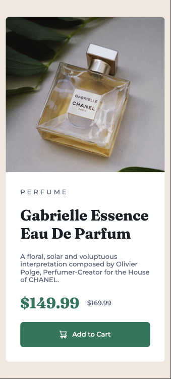
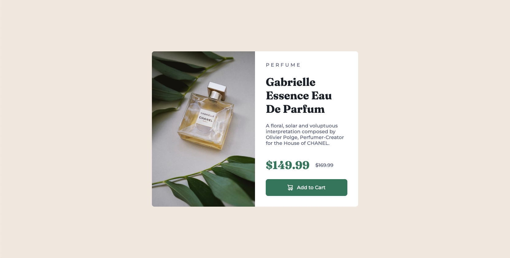

# Frontend Mentor - QR code component solution

This is a solution to the [QR code component challenge on Frontend Mentor](https://www.frontendmentor.io/challenges/qr-code-component-iux_sIO_H). Frontend Mentor challenges help you improve your coding skills by building realistic projects. 

## Table of contents

- [Overview](#overview)
  - [Screenshot](#screenshot)
  - [Links](#links)
- [My process](#my-process)
  - [What I learned](#what-i-learned)
- [Author](#author)

**Note: Delete this note and update the table of contents based on what sections you keep.**

## Overview

### Screenshot

- Mobile design



- Desktop design



### Links

- Solution URL: [Add solution URL here](https://github.com/ibzan79/frontend-blogpreview)
- Live Site URL: [Add live site URL here](https://ibzan79.github.io/frontend-blogpreview/)

## My process

### What I learned

- change picture depending on size screen
```html
<picture>
    <source media="(min-width: 768px)" srcset="./images/image-product-desktop.jpg">
    
</picture>
```

- overflow: hidden para que el borde redondeado aplique a la imagen correctamente
```css
.product-card {
    max-width: 24rem;

    background-color: var(--clr-s-white);

    border-radius: 0.5rem;
    overflow: hidden; /* Sirve para que el borde redondeado se aplique correctamente a la imagen */
}
```

- new text properties
```css
.product-type {
    text-transform: uppercase;
    letter-spacing: 0.3em;
    margin: 0 0 1.5rem 0;
}

.product-prices p:last-child {
    text-decoration: line-through;
    color: var(--clr-s-grey);
}
```

- Responsive desktop design
```css
@media (min-width: 768px) {
    .product-card {
        display: flex; /* Esto permite que la imagen y el contenido estén en una misma fila */
        max-width: 42rem;
    }
    
    picture {
        width: 50%; /* La imagen ocupa la mitad del contenedor .product-card */
        display: flex; /* Hace que la imagen se centre verticalmente dentro del contenedor */
    }

    .perfume-image {
        width: 100%; /* La imagen ocupa todo el ancho del contenedor picture */
        height: 100%; /* La imagen ocupa todo el alto del contenedor picture */
        object-fit: cover; /* Esto asegura que la imagen mantenga su proporción y se recorte si es necesario para llenar el espacio */
    }

    .product-content {
        display: flex;
        flex-direction: column;
        width: 50%; /* El contenido ocupa la otra mitad del contenedor .product-card */
        box-sizing: border-box; /* Esto hace que el padding se incluya dentro del ancho y alto del elemento */
    }

    .product-content h1 {
        margin: 0 0 0.5rem 0;
    }

    .add-to-cart-button {
        padding: 1.1rem;
    }
}
```

## Author

- Frontend Mentor - [@ibzan79](https://www.frontendmentor.io/profile/ibzan79)  
- GitHub - [ibzan79](https://github.com/ibzan79)
